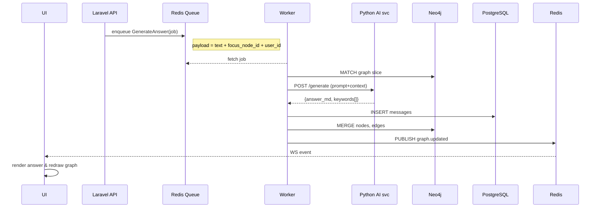

# Codex – Architecture Design

*Version 0.1 — June 17 2025*

---

## 2.1 High‑Level Component Map

```text
┌────────────┐           HTTPS / WSS            ┌─────────────────────────┐
│  Frontend  │  ──────────────────────────────► │ Laravel 12 API Gateway  │
│  SPA (Vue) │  ◄──────── live updates ─────── │  • Auth (Sanctum/JWT)   │
└────────────┘                                 │  • Rate‑limit & Billing │
        ▲                                      │  • Horizon Queues       │
        │ WebSocket                            └─────────┬──────────────┘
        │                                                      │
        │                               Redis pub/sub (events) │
        │                                                      ▼
                    ┌──────────────┐      HTTP/JSON      ┌───────────────┐
                    │  Worker Pool │ ◄────────────────── │ Python AI svc │
                    │  (Laravel)   │                    │  (FastAPI)    │
                    └───┬──────────┘                    └───────────────┘
                        │    Bolt / HTTP               ▲   ▲
      Bolt / HTTP       │                              │   │ OpenAI / Ollama
          ▲             ▼                              │   │
┌──────────────┐   ┌──────────────┐                    │   │
│ Neo4j Aura   │   │ PostgreSQL 16│ ◄──── pgvector ────┘   │
└──────────────┘   └──────────────┘                        │
          ▲                                               ▼
          └────────────── metrics / logs ─────────────── Prometheus + Grafana
```

**Single‑responsibility principle**: UI ↔ Gateway ↔ Worker ↔ AI svc are cleanly separated to keep tech boundaries (PHP vs Python) and enable independent scaling.

---

## 2.2 Data Model (Relational + Graph)

### 2.2.1 Relational (PostgreSQL)

| Table        | Purpose                          | Selected Fields                                              |
| ------------ | -------------------------------- | ------------------------------------------------------------ |
| `users`      | auth, plan, quota                | `id`, `email`, `password_hash`, `plan`, `stripe_customer_id` |
| `messages`   | chat logs                        | `id`, `user_id`, `node_id?`, `role`, `content`, `ts`         |
| `embeddings` | vector index for semantic search | `node_id PK`, `vector (1536‑float)`, **pgvector index**      |
| `jobs`       | Laravel Horizon queue table      | `id`, `payload`, `attempts`, …                               |
| `audit_logs` | GDPR export & compliance         | `id`, `user_id`, `action`, `details`, `ts`                   |

### 2.2.2 Graph (Neo4j)

```
(:Node {id, term, summary, familiarity})
(:User)-[:OWNS]->(:Node)
(:Node)-[:RELATED {type, weight}]->(:Node)
```

Neo4j multi‑tenant: each `user_id` is stored as node property + all queries `WHERE n.user_id = $uid` to avoid separate DB per tenant.

---

## 2.3 Service API Contracts (HTTP, JSON‑RPC style)

| Endpoint                     | Method | Body Params              | Response                                         |
| ---------------------------- | ------ | ------------------------ | ------------------------------------------------ |
| `/api/ask`                   | POST   | `text`, `focus_node_id?` | `answer_markdown`, `extracted_terms[]`           |
| `/api/nodes/:id`             | GET    | –                        | node JSON inc. neighbours                        |
| `/api/nodes/:id/familiarity` | PATCH  | `{value: 0–1}`           | status 204                                       |
| `/api/graphs/recent`         | GET    | pagination               | list of recent roots                             |
| `/ws`                        | WS     | (token)                  | pushes `graph.updated` & `answer.created` events |

*All endpoints JWT‑protected (Sanctum token via `localStorage`).*

---

## 2.4 Runtime Sequence – `/ask`



*Target end‑to‑end P95 latency*: **≤ 4 s** with GPT‑4o.

---

## 2.5 Background Jobs & Schedules

| Job                 | Cron             | Tech               | Notes                                              |
| ------------------- | ---------------- | ------------------ | -------------------------------------------------- |
| `decay_familiarity` | daily 03:00 UTC  | Laravel command    | `MATCH (n:Node) SET n.familiarity *= 0.97`         |
| `spaced_rep_email`  | hourly batch     | Laravel + Postmark | pick nodes `< τ`, send quiz link                   |
| `compress_graph`    | weekly Sun 04:00 | Python script      | Louvain clustering → merge meta‑nodes              |
| `vector_sync`       | realtime         | pg trigger → queue | when node updated, regenerate embedding via AI svc |

---

## 2.6 Scaling & Reliability

| Layer             | Bottleneck      | Scaling Strategy                                  | Failure Mode            |
| ----------------- | --------------- | ------------------------------------------------- | ----------------------- |
| Gateway (Laravel) | PHP workers     | ECS Fargate auto‑scale on CPU                     | circuit‑breaker → 503   |
| Worker            | background jobs | separate Fargate svc, scale by Redis queue length | dead‑letter queue       |
| AI svc            | LLM throughput  | GPU autoscaling group (Spot)                      | fallback to GPT‑4o SaaS |
| Neo4j Aura        | graph writes    | Aura auto‑autoscale; write txn batching           | retry w/ back‑off       |
| Postgres          | connection pool | RDS Aurora, reader replicas                       | read replica redirect   |

---

## 2.7 Non‑Functional Requirements

* **Security**: OWASP 10, JWT expiry 1 h, rotated refresh token, Cloudflare WAF.
* **Observability**: OpenTelemetry traces → Grafana Cloud; Prometheus for queue depth, GPT latency.
* **SLA**: 99.5 % API uptime; 24 h RPO, 15 min RTO (daily snapshots + WAL shipping).

---

## 2.8 Deployment Topology

| Env           | Stack                                                    | Notes                              |
| ------------- | -------------------------------------------------------- | ---------------------------------- |
| **Local dev** | Docker‑compose (php‑fpm, node, neo4j, pg, redis, ollama) | hot‑reload code volumes            |
| **Staging**   | AWS ECS Fargate; RDS db‑t3.medium; Aura Free             | auto‑preview via PR comment        |
| **Prod**      | ECS Fargate; RDS Aurora Serverless v2; Aura Pro          | blue‑green deploy, janitor lambdas |

Terraform modules per layer; GitHub Actions runs `tf plan` + `tf apply` on tagged release.

---

## 2.9 CI/CD Pipeline

1. **Push** → branch ⇒ *lint + PHPUnit + Vitest + Bandit*
2. **PR merged** ⇒ build Docker images, run e2e Cypress tests
3. **Tag v#** ⇒ GitHub Release → Terraform apply staging
4. Manual approver → promote to prod (blue‑green)
5. Post‑deploy smoke tests, rollback on failure.

---

## 2.10 Open Questions / Risks

| Area               | Question                    | Mitigation Idea                                |
| ------------------ | --------------------------- | ---------------------------------------------- |
| Multi‑tenant Neo4j | single DB vs per‑tenant db? | POC performance under heavy user graph mixing  |
| LLM cost           | GPT‑4o price volatility     | cache embeddings, explore Mixtral fine‑tune    |
| Graph privacy      | user exports & deletes      | implement GDPR delete cascade, encrypt at rest |

---

> **Next Steps:** finalise API JSON schema; spike the `/ask` flow with Neo4j & GPT‑4o; load‑test with JMeter for P95 latency.
